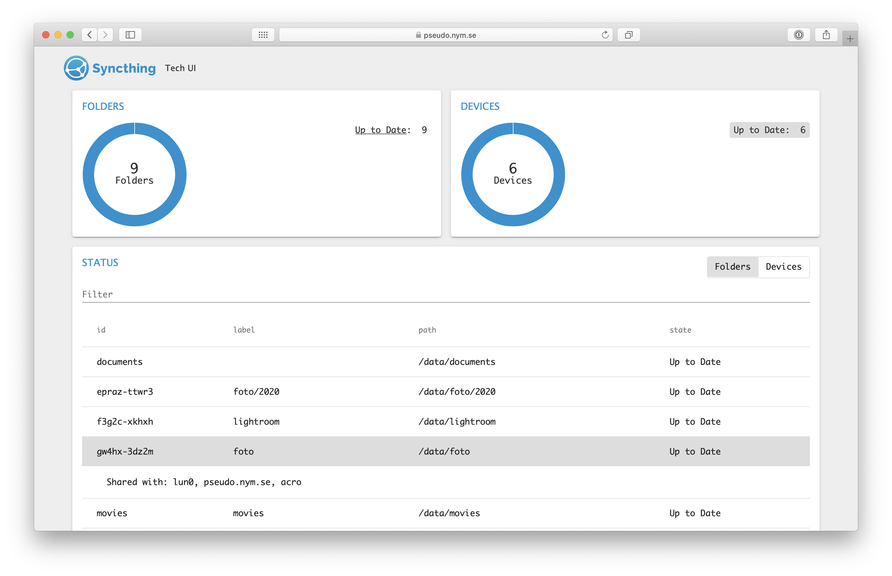

# Syncthing Tech UI

## Usage

This is a very bare bones read-only GUI for viewing the status of large
setups. Download a [release
zip](https://github.com/kastelo/syncthing-tech-ui/releases) and unpack it
into the GUI override directory (assuming default Linux setup):

```
$ cd ~/.config/syncthing
$ mkdir -p gui/default
$ cd gui/default
$ unzip ~/tech-ui-v1.0.0.zip
```

Then load the GUI via http://localhost:8384/tech-ui/ or similar. You should see something like this:



## Development server

Run `npm run serve` for a dev server. Navigate to `http://localhost:4200/`. The
app will automatically reload if you change any of the source files.

## Production server

In production we serve the UI through Syncthing itself. The easiest way to
do that is to simply put the built assets in the `gui` subdirectory of
Syncthing's config directory.

```
$ npm run build -- --prod
$ rsync -va --delete dist/tech-ui/ ~/.config/syncthing/gui/default/tech-ui/
```

Adjust for your actual Syncthing config dir if different. Navigate to
`http://localhost:8384/tech-ui/`.

Another option is to start Syncthing with the STGUIASSETS environment
variable pointing to the distribution directory.

```
$ npm run build -- --prod
$ ln -sf . dist/default
$ export STGUIASSETS=$(pwd)/dist
$ syncthing
```

The magic is symlink is because Syncthing will look for the GUI in the
`default` subdirectory. Navigate to `http://localhost:8384/tech-ui/`.

## Code scaffolding

Run `ng generate component component-name` to generate a new component. You
can also use `ng generate
directive|pipe|service|class|guard|interface|enum|module`.

## License

MPLv2

## Copyright

Copyright (c) 2020 Kastelo Inc.
